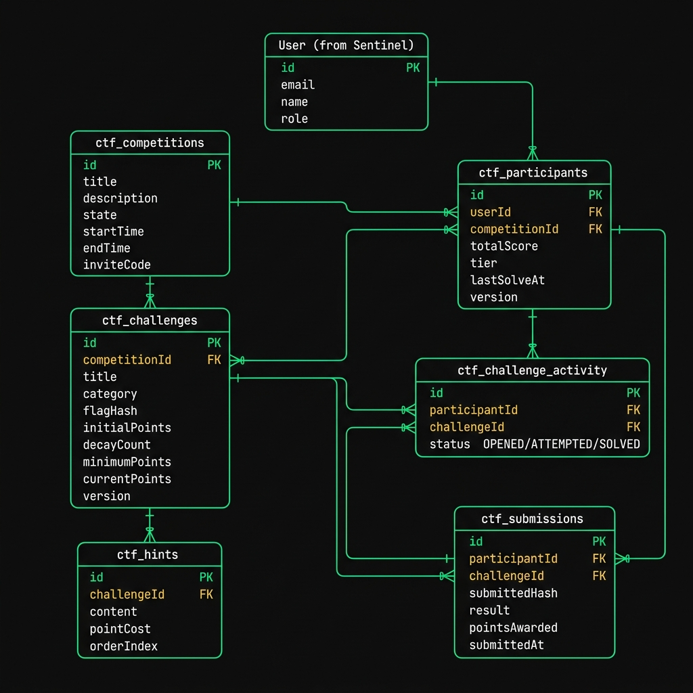

# CTF Wars — Database Schema Updates

> **Author:** Engineering Team (Dhairy Tanna)
> **Status:** APPROVED

*Note: This is a simplified, readable view of the new database tables we will add to our Node.js backend. We will connect to the existing PostgreSQL database.*

---

## 0. Entity Relationship (ER) Diagram

---

## 1. The Core Tables

### A. Competitions (`ctf_competitions`)
Stores the main event details.
*   `title`, `description`, `rules`
*   `state` (Draft, Open, Active, Paused, Ended)
*   `startTime`, `endTime`
*   `inviteCode` (Short string for players to join)

### B. Challenges (`ctf_challenges`)
Stores the questions players need to solve.
*   `title`, `description`, `category` (Web, Crypto, etc.)
*   `flagHash` (The answer, securely hashed so even admins can't steal it)
*   `flagType` (Exact Match, Regex, or Manual Review)
*   **Parabolic Scoring Fields:**
    *   `initialPoints` (Starting value)
    *   `decayCount` (How many solves until it hits minimum)
    *   `minimumPoints` (The floor value)
*   `currentPoints` (Auto-updates as people solve it)

### C. Hints (`ctf_hints`)
Optional clues players can buy.
*   `content` (The clue)
*   `pointCost` (How much it costs to reveal)
*   `orderIndex` (Hint 1, Hint 2, etc.)

---

## 2. Player Tracking Tables

### D. Participants (`ctf_participants`)
Links a user to a specific competition.
*   `userId`
*   `competitionId`
*   `totalScore` (Cached for fast leaderboard loading)
*   `tier` (Apprentice, Journeyman, Master, Grandmaster — auto-calculated)
*   `lastSolveAt` (Used to break ties on the leaderboard)

### E. Challenge Activity (`ctf_challenge_activity`)
**NEW:** Powers the "Player Progression Matrix" (CTFd feature).
Tracks the exact state of a player on a specific challenge.
*   `participantId`
*   `challengeId`
*   `status` (Enum: `OPENED`, `ATTEMPTED`, `SOLVED`)
*   `updatedAt` (When their status changed)

### F. Submissions (`ctf_submissions`)
The raw log of every guess made by a player. Powers the Admin Submission Filter.
*   `participantId`
*   `challengeId`
*   `submittedHash` (What they guessed, hashed)
*   `result` (Enum: `CORRECT`, `INCORRECT`, `PENDING_REVIEW`)
*   `pointsAwarded` (Exactly how many points they got at that exact moment)
*   `submittedAt` (Timestamp)

---

## 3. Concurrency Protection (The "Version" Field)
To prevent the server from crashing when 150 people submit flags simultaneously:
*   Every table that changes frequently (Participants, Challenges) has a `version` integer field.
*   Whenever the Node.js server updates a score, it checks the version first. This is called **Optimistic Concurrency Control (OCC)** and is standard for high-performance apps.
