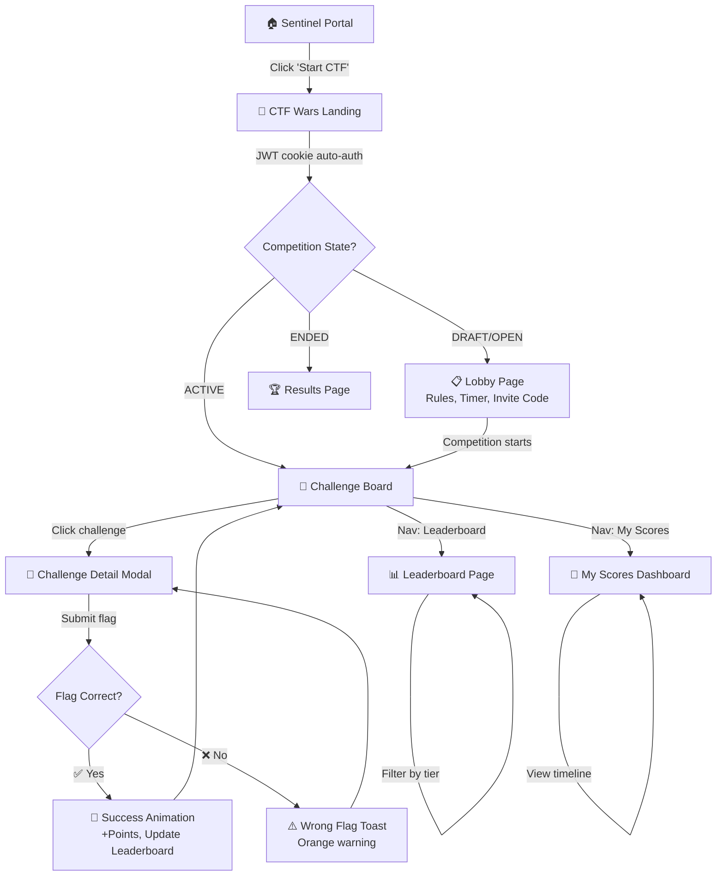

# CTF Wars — Implementation Plan (Chunks 1 to 8)

> **Author:** Engineering Team (Dhairya Tanna)
> **Status:** APPROVED

---

## Part A: Competitive Platform Research

| Platform | What We Adopted | What We Ignored | Unique to Us |
|---|---|---|---|
| **CTFd** | Challenge Board, Parabolic Scoring, Leaderboard, Progression Matrix (heatmap), Hints | - | **5-Second Admin Freeze** |
| **HackTheBox** | Team leaderboard view, "My Scores" dashboard | XP System, Spawnable VMs | **Live Presence per Challenge** |
| **PicoCTF** | Difficulty filter (Easy → Insane) | Web Shell, Learning Resources | **3-Layer Concurrency Defense** |
| **TryHackMe** | Admin analytics dashboard | Rooms, Paths, AttackBox | **Cross-Domain Sentinel Auth** |
| **Facebook CTF** | Clean GUI (Green/Black theme goal) | "Conquer Map" visualization | **Parabolic Decay + Denorm Cache** |

---

## Part B: Complete Wireframe Flow

### User Journey Map

### Screen Inventory

#### 🎮 Player Screens
| Route | Screen Name | Description |
|---|---|---|
| `/lobby` | **CTF Lobby** | Rules, countdown timer to start, invite code. |
| `/challenges` | **Challenge Board** | Grid of cards (points, solve count, "👁️ viewing"). |
| Modal | **Challenge Detail** | Full description, file downloads, hints, flag input box. |
| `/leaderboard` | **Leaderboard** | Ranked table with tier-colored names, pagination. |
| `/my-scores` | **My Scores** | Personal stats: total score, tier, solve timeline chart. |

#### 🛡️ Admin Screens
| Route | Screen Name | Description |
|---|---|---|
| `/admin` | **Admin Dashboard** | KPIs, Most/Least solved challenges. |
| `/admin/competitions` | **Manage Competitions** | Create/Edit/Start/Stop/Pause competitions. |
| `/admin/challenges` | **Manage Challenges** | CRUD for challenges, hints, points, files. |
| `/admin/matrix` | **Progression Matrix** | Color-coded heatmap grid (Players × Challenges). |
| `/admin/submissions` | **Submission Logs** | Real-time feed of all submissions. |

---

## Part C: All Micro-Chunks (Roadmap)

### ✅ Completed
*   **#1 Documentation & Tech Stack Spec** (Done)
*   **#2 Backend & Frontend Scaffolding** (Done)
*   **#3 Auth Middleware & Role Guard** (Done)
*   **#4 Competition & Challenge Read APIs + Live Fix** (Done)

### 🔜 Remaining

#### Micro-Chunk #5: Flag Submission Engine (The Core)
> **Goal:** Handle flag submissions with full concurrency protection.
*   **Files:** `submissions.ts`, `scoring.ts`, `locks.ts`
*   **Topics:** Race conditions, distributed locking, OCC, bcrypt

#### Micro-Chunk #6: Leaderboard & Real-Time Engine
> **Goal:** Live leaderboard + presence system + admin freeze broadcast.
*   **Files:** `leaderboard.ts`, `myScores.ts`, `presence.ts`, `adminFreeze.ts`, `scoreboard.ts`
*   **Topics:** WebSockets, Redis pub/sub, event-driven architecture

#### Micro-Chunk #7: Frontend — Player Screens
> **Goal:** Build all 5 player-facing screens with Green/Black theme.
*   **Topics:** React Suspense, skeleton loading UX, optimistic UI

#### Micro-Chunk #8: Frontend — Admin Screens
> **Goal:** Build all 4 admin-facing screens.
*   **Topics:** Data visualization, real-time data tables, role-based routing

---
*Note: Configured for Single Player (Team Mode planned for future) and supports Challenge File Downloads.*
